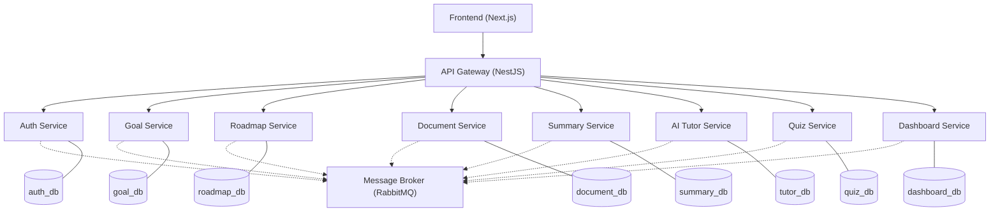
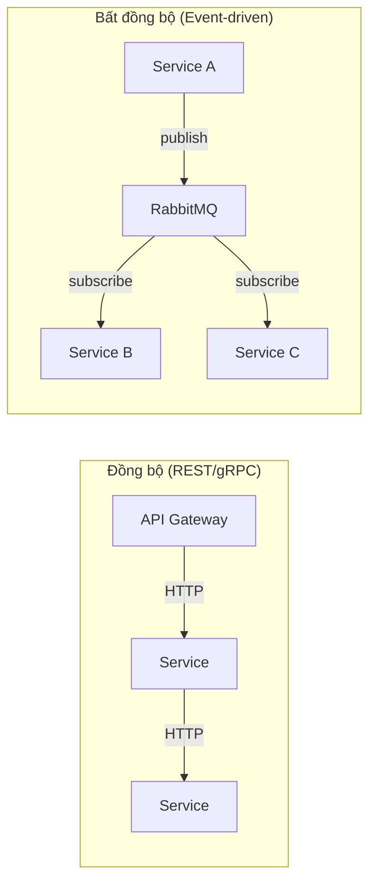
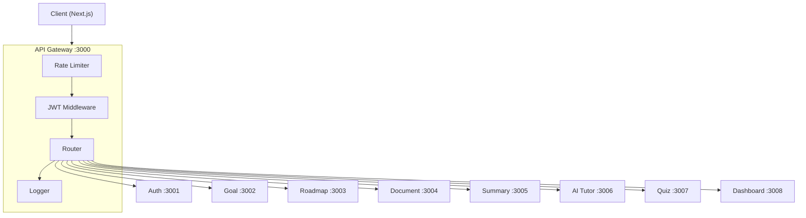

# AI Study Assistant — Microservices Architecture

## 1. Tổng quan kiến trúc



---

## 2. Danh sách Microservices

| # | Service | Port | Database | Mô tả ngắn |
|---|---------|------|----------|-------------|
| 0 | **API Gateway** | 3000 | — | Điểm vào duy nhất, routing, xác thực JWT |
| 1 | **Auth Service** | 3001 | `auth_db` | Đăng ký, đăng nhập, quản lý token |
| 2 | **Goal Service** | 3002 | `goal_db` | CRUD mục tiêu học tập |
| 3 | **Roadmap Service** | 3003 | `roadmap_db` | Tạo & quản lý lộ trình học |
| 4 | **Document Service** | 3004 | `document_db` | Upload, lưu trữ, quản lý tài liệu |
| 5 | **Summary Service** | 3005 | `summary_db` | Tóm tắt tài liệu bằng AI |
| 6 | **AI Tutor Service** | 3006 | `tutor_db` | Chatbot hỏi đáp, giải thích kiến thức |
| 7 | **Quiz Service** | 3007 | `quiz_db` | Tạo & chấm bài kiểm tra |
| 8 | **Dashboard Service** | 3008 | `dashboard_db` | Tổng hợp tiến độ, thống kê |

---

## 3. Chi tiết từng Service

### 0. API Gateway (`port 3000`)

| Mục | Chi tiết |
|-----|---------|
| **Nhiệm vụ** | Routing request đến đúng service, xác thực JWT, rate limiting, logging |
| **Tech** | NestJS + `@nestjs/microservices` |
| **Database** | Không có (stateless) |

**Endpoints mẫu:**

```
ANY /api/auth/**    → Auth Service
ANY /api/goals/**   → Goal Service
ANY /api/roadmaps/** → Roadmap Service
ANY /api/documents/** → Document Service
ANY /api/summaries/** → Summary Service
ANY /api/tutor/**   → AI Tutor Service
ANY /api/quizzes/** → Quiz Service
ANY /api/dashboard/** → Dashboard Service
```

---

### 1. Auth Service (`port 3001`)

| Mục | Chi tiết |
|-----|---------|
| **Nhiệm vụ** | Đăng ký, đăng nhập, refresh token, quản lý profile |
| **Database** | `auth_db` |

**Database Schema:**

```sql
-- users
CREATE TABLE users (
    id          UUID PRIMARY KEY DEFAULT gen_random_uuid(),
    email       VARCHAR(255) UNIQUE NOT NULL,
    password    VARCHAR(255) NOT NULL,
    full_name   VARCHAR(100),
    avatar_url  TEXT,
    role        VARCHAR(20) DEFAULT 'student',
    created_at  TIMESTAMP DEFAULT NOW(),
    updated_at  TIMESTAMP DEFAULT NOW()
);

-- refresh_tokens
CREATE TABLE refresh_tokens (
    id          UUID PRIMARY KEY DEFAULT gen_random_uuid(),
    user_id     UUID REFERENCES users(id) ON DELETE CASCADE,
    token       TEXT NOT NULL,
    expires_at  TIMESTAMP NOT NULL,
    created_at  TIMESTAMP DEFAULT NOW()
);
```

**API:**

| Method | Endpoint | Mô tả |
|--------|----------|--------|
| POST | `/register` | Đăng ký |
| POST | `/login` | Đăng nhập → JWT |
| POST | `/refresh` | Refresh access token |
| GET | `/profile` | Lấy thông tin user |
| PUT | `/profile` | Cập nhật profile |

**Events phát ra:** `user.created`, `user.updated`

---

### 2. Goal Service (`port 3002`)

| Mục | Chi tiết |
|-----|---------|
| **Nhiệm vụ** | CRUD mục tiêu học tập, theo dõi tiến độ mục tiêu |
| **Database** | `goal_db` |

**Database Schema:**

```sql
CREATE TABLE goals (
    id          UUID PRIMARY KEY DEFAULT gen_random_uuid(),
    user_id     UUID NOT NULL,
    title       VARCHAR(255) NOT NULL,
    description TEXT,
    category    VARCHAR(50),
    status      VARCHAR(20) DEFAULT 'active',  -- active | completed | paused
    target_date DATE,
    progress    INT DEFAULT 0,                  -- 0-100
    created_at  TIMESTAMP DEFAULT NOW(),
    updated_at  TIMESTAMP DEFAULT NOW()
);

CREATE TABLE milestones (
    id          UUID PRIMARY KEY DEFAULT gen_random_uuid(),
    goal_id     UUID REFERENCES goals(id) ON DELETE CASCADE,
    title       VARCHAR(255) NOT NULL,
    is_done     BOOLEAN DEFAULT FALSE,
    due_date    DATE,
    created_at  TIMESTAMP DEFAULT NOW()
);
```

**API:**

| Method | Endpoint | Mô tả |
|--------|----------|--------|
| POST | `/` | Tạo goal |
| GET | `/` | Danh sách goals của user |
| GET | `/:id` | Chi tiết goal |
| PUT | `/:id` | Cập nhật goal |
| DELETE | `/:id` | Xóa goal |
| POST | `/:id/milestones` | Thêm milestone |

**Events phát ra:** `goal.created`, `goal.completed`, `goal.progress_updated`

---

### 3. Roadmap Service (`port 3003`)

| Mục | Chi tiết |
|-----|---------|
| **Nhiệm vụ** | Tạo lộ trình học (AI-generated hoặc thủ công), quản lý các bước học |
| **Database** | `roadmap_db` |

**Database Schema:**

```sql
CREATE TABLE roadmaps (
    id          UUID PRIMARY KEY DEFAULT gen_random_uuid(),
    user_id     UUID NOT NULL,
    goal_id     UUID,                          -- liên kết goal (optional)
    title       VARCHAR(255) NOT NULL,
    description TEXT,
    is_ai       BOOLEAN DEFAULT FALSE,         -- AI tạo hay thủ công
    created_at  TIMESTAMP DEFAULT NOW(),
    updated_at  TIMESTAMP DEFAULT NOW()
);

CREATE TABLE roadmap_steps (
    id          UUID PRIMARY KEY DEFAULT gen_random_uuid(),
    roadmap_id  UUID REFERENCES roadmaps(id) ON DELETE CASCADE,
    order_index INT NOT NULL,
    title       VARCHAR(255) NOT NULL,
    description TEXT,
    duration    VARCHAR(50),                   -- "2 tuần", "3 ngày"
    status      VARCHAR(20) DEFAULT 'pending', -- pending | in_progress | done
    resources   JSONB,                         -- [{type, url, title}]
    created_at  TIMESTAMP DEFAULT NOW()
);
```

**API:**

| Method | Endpoint | Mô tả |
|--------|----------|--------|
| POST | `/` | Tạo roadmap thủ công |
| POST | `/generate` | AI tạo roadmap từ goal |
| GET | `/` | Danh sách roadmaps |
| GET | `/:id` | Chi tiết roadmap + steps |
| PUT | `/:id/steps/:stepId` | Cập nhật trạng thái step |

**Events lắng nghe:** `goal.created` → gợi ý tạo roadmap  
**Events phát ra:** `roadmap.step_completed`

---

### 4. Document Service (`port 3004`)

| Mục | Chi tiết |
|-----|---------|
| **Nhiệm vụ** | Upload tài liệu (PDF, DOCX, TXT), lưu trữ, trích xuất text |
| **Database** | `document_db` + Object Storage (MinIO/S3) |

**Database Schema:**

```sql
CREATE TABLE documents (
    id            UUID PRIMARY KEY DEFAULT gen_random_uuid(),
    user_id       UUID NOT NULL,
    title         VARCHAR(255) NOT NULL,
    file_name     VARCHAR(255),
    file_url      TEXT,
    file_type     VARCHAR(20),                 -- pdf | docx | txt
    file_size     BIGINT,
    extracted_text TEXT,                        -- full text sau khi parse
    tags          TEXT[],
    created_at    TIMESTAMP DEFAULT NOW()
);
```

**API:**

| Method | Endpoint | Mô tả |
|--------|----------|--------|
| POST | `/upload` | Upload file |
| GET | `/` | Danh sách tài liệu |
| GET | `/:id` | Chi tiết + nội dung |
| DELETE | `/:id` | Xóa tài liệu |

**Events phát ra:** `document.uploaded` (kèm `extracted_text` để Summary & Tutor xử lý)

---

### 5. Summary Service (`port 3005`)

| Mục | Chi tiết |
|-----|---------|
| **Nhiệm vụ** | Tóm tắt tài liệu bằng AI (OpenAI / Gemini), lưu kết quả |
| **Database** | `summary_db` |

**Database Schema:**

```sql
CREATE TABLE summaries (
    id            UUID PRIMARY KEY DEFAULT gen_random_uuid(),
    user_id       UUID NOT NULL,
    document_id   UUID NOT NULL,
    summary_text  TEXT NOT NULL,
    key_points    JSONB,                       -- ["point1", "point2"]
    model_used    VARCHAR(50),                 -- "gpt-4", "gemini-pro"
    created_at    TIMESTAMP DEFAULT NOW()
);
```

**API:**

| Method | Endpoint | Mô tả |
|--------|----------|--------|
| POST | `/generate` | Tạo summary từ document_id |
| GET | `/document/:docId` | Lấy summary theo tài liệu |
| GET | `/:id` | Chi tiết summary |

**Events lắng nghe:** `document.uploaded` → tự động tóm tắt  
**Events phát ra:** `summary.created`

---

### 6. AI Tutor Service (`port 3006`)

| Mục | Chi tiết |
|-----|---------|
| **Nhiệm vụ** | Chatbot AI hỏi đáp, giải thích kiến thức dựa trên tài liệu user |
| **Database** | `tutor_db` |

**Database Schema:**

```sql
CREATE TABLE conversations (
    id          UUID PRIMARY KEY DEFAULT gen_random_uuid(),
    user_id     UUID NOT NULL,
    document_id UUID,                          -- context tài liệu (optional)
    title       VARCHAR(255),
    created_at  TIMESTAMP DEFAULT NOW(),
    updated_at  TIMESTAMP DEFAULT NOW()
);

CREATE TABLE messages (
    id              UUID PRIMARY KEY DEFAULT gen_random_uuid(),
    conversation_id UUID REFERENCES conversations(id) ON DELETE CASCADE,
    role            VARCHAR(10) NOT NULL,       -- 'user' | 'assistant'
    content         TEXT NOT NULL,
    tokens_used     INT,
    created_at      TIMESTAMP DEFAULT NOW()
);
```

**API:**

| Method | Endpoint | Mô tả |
|--------|----------|--------|
| POST | `/conversations` | Tạo cuộc hội thoại mới |
| POST | `/conversations/:id/messages` | Gửi tin nhắn → AI trả lời |
| GET | `/conversations` | Danh sách conversations |
| GET | `/conversations/:id` | Lịch sử chat |

---

### 7. Quiz Service (`port 3007`)

| Mục | Chi tiết |
|-----|---------|
| **Nhiệm vụ** | Tạo quiz từ tài liệu (AI-generated), chấm điểm, lưu kết quả |
| **Database** | `quiz_db` |

**Database Schema:**

```sql
CREATE TABLE quizzes (
    id            UUID PRIMARY KEY DEFAULT gen_random_uuid(),
    user_id       UUID NOT NULL,
    document_id   UUID,
    title         VARCHAR(255) NOT NULL,
    total_questions INT,
    created_at    TIMESTAMP DEFAULT NOW()
);

CREATE TABLE questions (
    id          UUID PRIMARY KEY DEFAULT gen_random_uuid(),
    quiz_id     UUID REFERENCES quizzes(id) ON DELETE CASCADE,
    content     TEXT NOT NULL,
    options     JSONB NOT NULL,                -- ["A. ...", "B. ...", ...]
    correct     VARCHAR(5) NOT NULL,           -- "A"
    explanation TEXT,
    order_index INT
);

CREATE TABLE quiz_attempts (
    id          UUID PRIMARY KEY DEFAULT gen_random_uuid(),
    quiz_id     UUID REFERENCES quizzes(id),
    user_id     UUID NOT NULL,
    answers     JSONB NOT NULL,                -- {"q1": "A", "q2": "C"}
    score       DECIMAL(5,2),
    completed_at TIMESTAMP DEFAULT NOW()
);
```

**API:**

| Method | Endpoint | Mô tả |
|--------|----------|--------|
| POST | `/generate` | AI tạo quiz từ document_id |
| GET | `/:id` | Lấy quiz (câu hỏi) |
| POST | `/:id/submit` | Nộp bài → chấm điểm |
| GET | `/:id/results` | Xem kết quả |

**Events phát ra:** `quiz.completed` (kèm score)

---

### 8. Dashboard Service (`port 3008`)

| Mục | Chi tiết |
|-----|---------|
| **Nhiệm vụ** | Tổng hợp dữ liệu từ các service, thống kê tiến độ học tập |
| **Database** | `dashboard_db` (materialized/aggregated data) |

**Database Schema:**

```sql
CREATE TABLE user_stats (
    id              UUID PRIMARY KEY DEFAULT gen_random_uuid(),
    user_id         UUID UNIQUE NOT NULL,
    total_goals     INT DEFAULT 0,
    completed_goals INT DEFAULT 0,
    total_documents INT DEFAULT 0,
    total_quizzes   INT DEFAULT 0,
    avg_quiz_score  DECIMAL(5,2) DEFAULT 0,
    study_streak    INT DEFAULT 0,
    last_active     TIMESTAMP,
    updated_at      TIMESTAMP DEFAULT NOW()
);

CREATE TABLE activity_log (
    id          UUID PRIMARY KEY DEFAULT gen_random_uuid(),
    user_id     UUID NOT NULL,
    action      VARCHAR(50) NOT NULL,          -- 'quiz_completed', 'doc_uploaded'
    metadata    JSONB,
    created_at  TIMESTAMP DEFAULT NOW()
);
```

**API:**

| Method | Endpoint | Mô tả |
|--------|----------|--------|
| GET | `/stats` | Thống kê tổng hợp của user |
| GET | `/activity` | Lịch sử hoạt động |
| GET | `/progress` | Tiến độ theo thời gian |

**Events lắng nghe:** `goal.*`, `quiz.completed`, `document.uploaded`, `roadmap.step_completed`

---

## 4. Giao tiếp giữa các Service

### 4.1 Hai kiểu giao tiếp



| Kiểu | Khi nào dùng | Ví dụ |
|------|-------------|-------|
| **Đồng bộ** (HTTP/gRPC) | Client cần response ngay | Gateway → Auth (xác thực), Frontend → Quiz (lấy câu hỏi) |
| **Bất đồng bộ** (RabbitMQ) | Không cần response ngay, fan-out | `document.uploaded` → Summary tự tóm tắt, Dashboard cập nhật |

### 4.2 Luồng Event chính

```
document.uploaded  → Summary Service (tạo summary)
                   → Dashboard Service (cập nhật stats)

goal.created       → Roadmap Service (gợi ý roadmap)
                   → Dashboard Service (cập nhật stats)

goal.completed     → Dashboard Service (cập nhật stats)

quiz.completed     → Dashboard Service (cập nhật score, stats)

summary.created    → Dashboard Service (cập nhật stats)

user.created       → Dashboard Service (khởi tạo user_stats)
```

### 4.3 Sync calls giữa services

```
Summary Service  → Document Service  (lấy extracted_text)
AI Tutor Service → Document Service  (lấy context tài liệu)
Quiz Service     → Document Service  (lấy nội dung để gen quiz)
Roadmap Service  → Goal Service      (lấy thông tin goal)
```

---

## 5. API Gateway — Chi tiết



**Chức năng Gateway:**

| Chức năng | Mô tả |
|-----------|--------|
| **Routing** | Chuyển tiếp request đến đúng service |
| **Authentication** | Verify JWT token (gọi Auth Service) |
| **Rate Limiting** | Giới hạn request/phút theo user |
| **Request Logging** | Ghi log tất cả request |
| **Error Handling** | Chuẩn hóa error response |
| **CORS** | Xử lý cross-origin |

---

## 6. Tech Stack tổng hợp

| Layer | Công nghệ |
|-------|-----------|
| Frontend | Next.js 14 (App Router) |
| API Gateway | NestJS |
| Backend Services | NestJS |
| Database | PostgreSQL (mỗi service 1 DB riêng) |
| Message Broker | RabbitMQ |
| AI Provider | OpenAI API / Google Gemini API |
| File Storage | MinIO (self-hosted S3) |
| Auth | JWT (access + refresh token) |
| Container | Docker + Docker Compose |
| Service Discovery | Docker DNS (dev) / Kubernetes (prod) |

---

## 7. Cấu trúc thư mục

```
ai-study-assistant/
├── docker-compose.yml
├── gateway/                    # API Gateway (NestJS)
├── services/
│   ├── auth-service/           # Auth (NestJS + PostgreSQL)
│   ├── goal-service/
│   ├── roadmap-service/
│   ├── document-service/
│   ├── summary-service/
│   ├── tutor-service/
│   ├── quiz-service/
│   └── dashboard-service/
├── frontend/                   # Next.js
├── shared/                     # Shared DTOs, interfaces, constants
└── infra/                      # Docker, K8s configs
```
