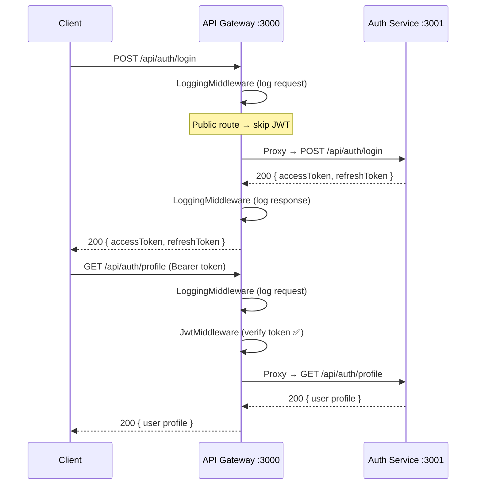

# API Gateway (NestJS) — Walkthrough

## Tổng quan

Đã triển khai API Gateway chạy trên **port 3000**, proxy tất cả request `/api/auth/*` sang **auth-service** (port 3001).

## Cấu trúc thư mục

```
services/api-gateway/
├── .env                              # Cấu hình env
├── src/
│   ├── main.ts                       # Entrypoint (port 3000)
│   ├── app.module.ts                 # Root module
│   ├── middleware/
│   │   ├── logging.middleware.ts      # Log tất cả request/response
│   │   └── jwt.middleware.ts          # Xác thực JWT token
│   └── proxy/
│       ├── auth-proxy.module.ts      # Module proxy cho auth-service
│       └── auth-proxy.controller.ts  # Forward request sang auth-service
```

## Luồng hoạt động



## Middleware Pipeline

| Middleware | Áp dụng | Mô tả |
|-----------|---------|-------|
| **LoggingMiddleware** | Tất cả routes (`*`) | Log method, path, IP, user-agent, status code, duration |
| **JwtMiddleware** | `/api/auth/*` **trừ** register, login, refresh | Verify Bearer token, reject 401 nếu invalid |

## Route Mapping

| Gateway Route | Target | JWT Required |
|--------------|--------|:------------:|
| `POST /api/auth/register` | auth-service:3001 | ❌ |
| `POST /api/auth/login` | auth-service:3001 | ❌ |
| `POST /api/auth/refresh` | auth-service:3001 | ❌ |
| `POST /api/auth/logout` | auth-service:3001 | ✅ |
| `GET /api/auth/profile` | auth-service:3001 | ✅ |
| `PUT /api/auth/profile` | auth-service:3001 | ✅ |

## Cách chạy

```bash
# Terminal 1: auth-service
cd services/auth-service
npm run start:dev

# Terminal 2: api-gateway
cd services/api-gateway
npm run start:dev
```

## Test nhanh

```bash
# Qua gateway (port 3000):
curl -X POST http://localhost:3000/api/auth/login \
  -H "Content-Type: application/json" \
  -d '{"email":"test@example.com","password":"123456"}'

# Protected route — cần token:
curl http://localhost:3000/api/auth/profile \
  -H "Authorization: Bearer <your_token>"

# Không có token → 401:
curl http://localhost:3000/api/auth/profile
```

## Validation

- ✅ Build thành công (`npx nest build`)
- ✅ JWT middleware exclude public routes (register, login, refresh)
- ✅ Logging middleware ghi log request/response với duration
- ✅ Proxy error handling trả 502 khi auth-service down
