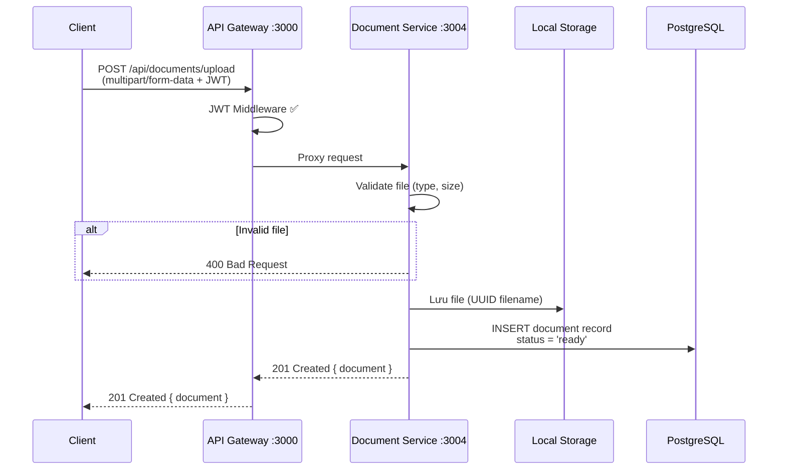

# Document Service — Implementation Plan

Thiết kế và triển khai Document Service cho hệ AI Study Assistant. Service quản lý upload, lưu trữ, và truy xuất tài liệu học tập (PDF, DOCX).

## Tổng quan

| Mục | Chi tiết |
|-----|---------|
| **Port** | 3004 |
| **Database** | `document_db` (PostgreSQL) |
| **ORM** | TypeORM (consistent với auth-service) |
| **File Storage** | Local disk (`./uploads/`) — đơn giản cho dev, sau chuyển sang MinIO/S3 |

---

## 1. Entity: Document

```typescript
@Entity('documents')
export class Document {
  id:             UUID (PK, auto-gen)
  userId:         UUID (NOT NULL)          // owner
  title:          VARCHAR(255)             // tên hiển thị
  originalName:   VARCHAR(255)             // tên file gốc khi upload
  fileName:       VARCHAR(255)             // tên file lưu trên server (UUID-based)
  filePath:       TEXT                     // đường dẫn file trên disk
  fileType:       ENUM('pdf','docx')       // loại file
  fileSize:       BIGINT                   // dung lượng (bytes)
  mimeType:       VARCHAR(100)             // application/pdf, etc.
  status:         ENUM('uploading','ready','error')  // trạng thái xử lý
  createdAt:      TIMESTAMP
  updatedAt:      TIMESTAMP
}
```

> [!NOTE]
> Không lưu `extracted_text` trong entity này — sẽ do Summary Service xử lý riêng. Giữ Document Service đơn giản, đúng SRP.

---

## 2. API Endpoints

| Method | Endpoint | Auth | Mô tả |
|--------|----------|:----:|--------|
| `POST` | `/api/documents/upload` | ✅ JWT | Upload file PDF/DOCX |
| `GET` | `/api/documents` | ✅ JWT | Danh sách tài liệu của user |
| `GET` | `/api/documents/:id` | ✅ JWT | Chi tiết tài liệu theo ID |

### 2.1 POST `/api/documents/upload`

**Request:** `multipart/form-data`
```
file: <binary>          (required, max 10MB)
title: "Bài giảng ML"   (optional, default = tên file gốc)
```

**Response:** `201 Created`
```json
{
  "id": "uuid",
  "title": "Bài giảng ML",
  "originalName": "bai_giang_ml.pdf",
  "fileType": "pdf",
  "fileSize": 2048000,
  "status": "ready",
  "createdAt": "2026-04-21T..."
}
```

**Validation:**
- File type: chỉ `.pdf`, `.docx`
- File size: tối đa 10MB
- Phải có JWT token hợp lệ

### 2.2 GET `/api/documents`

**Query params:**
```
?page=1&limit=10&fileType=pdf
```

**Response:** `200 OK`
```json
{
  "data": [{ document }, ...],
  "total": 25,
  "page": 1,
  "limit": 10
}
```

### 2.3 GET `/api/documents/:id`

**Response:** `200 OK` — trả document detail  
**Error:** `404` nếu không tìm thấy hoặc không thuộc user

---

## 3. Upload Flow



---

## 4. Proposed File Structure

```
services/document-service/
├── .env
├── package.json
├── tsconfig.json
├── nest-cli.json
├── uploads/                           # Thư mục lưu file upload
├── src/
│   ├── main.ts                        # Entrypoint (port 3004)
│   ├── app.module.ts                  # Root module
│   ├── config/
│   │   └── configuration.ts           # Env config
│   ├── entities/
│   │   └── document.entity.ts         # Document entity
│   ├── documents/
│   │   ├── documents.module.ts        # Feature module
│   │   ├── documents.controller.ts    # REST endpoints
│   │   ├── documents.service.ts       # Business logic
│   │   └── dto/
│   │       ├── upload-document.dto.ts
│   │       └── query-documents.dto.ts
│   └── common/
│       ├── filters/
│       │   └── http-exception.filter.ts
│       └── interceptors/
│           └── transform.interceptor.ts
```

---

## 5. Proposed Changes

### Config & Setup

#### [NEW] `.env`
- PORT=3004, database config (`document_db`), upload limits

#### [NEW] `package.json`  
- Dependencies: `@nestjs/core`, `@nestjs/typeorm`, `@nestjs/config`, `pg`, `multer`, `class-validator`, `uuid`

#### [NEW] `src/main.ts`
- Bootstrap app, port 3004, global prefix `/api/documents`

#### [NEW] `src/config/configuration.ts`
- Load env: database, upload config (max size, allowed types)

---

### Entity

#### [NEW] `src/entities/document.entity.ts`
- TypeORM entity matching schema above
- Enums: `FileType`, `DocumentStatus`

---

### Documents Module

#### [NEW] `src/documents/documents.module.ts`
- Import TypeOrmModule.forFeature([Document])
- Configure Multer (disk storage, file filter)

#### [NEW] `src/documents/documents.controller.ts`
- `POST /upload` — `@UseInterceptors(FileInterceptor)` + validate + save
- `GET /` — paginated list with query params
- `GET /:id` — find by ID + ownership check

#### [NEW] `src/documents/documents.service.ts`
- `upload()` — save file metadata to DB
- `findAll()` — query with pagination & filters
- `findOne()` — get by ID with user ownership validation

#### [NEW] `src/documents/dto/upload-document.dto.ts`
- `title` (optional string)

#### [NEW] `src/documents/dto/query-documents.dto.ts`  
- `page`, `limit`, `fileType` (optional filters)

---

### Common (reuse pattern từ auth-service)

#### [NEW] `src/common/filters/http-exception.filter.ts`
#### [NEW] `src/common/interceptors/transform.interceptor.ts`

---

## 6. Key Design Decisions

| Decision | Rationale |
|----------|-----------|
| **Local disk** thay vì MinIO/S3 | Đơn giản, dễ chạy ngay trên local. Có thể swap sang S3 sau |
| **Multer disk storage** | NestJS built-in, xử lý multipart tốt |
| **UUID filename** | Tránh trùng tên, bảo mật (không expose tên gốc trên URL) |
| **userId từ JWT** | Gateway đã verify JWT, service đọc userId từ header |
| **Không lưu extracted_text** | Để Summary Service chịu trách nhiệm parse/extract — đúng SRP |
| **Consistent patterns** | Follow cùng structure, filters, interceptors như auth-service |

---

## 7. Verification Plan

### Build & Run
```bash
cd services/document-service
npm install
npm run build          # verify TypeScript compile
npm run start:dev      # verify runtime
```

### Test thủ công
```bash
# Upload
curl -X POST http://localhost:3004/api/documents/upload \
  -H "Authorization: Bearer <token>" \
  -F "file=@test.pdf" \
  -F "title=Test Document"

# List
curl http://localhost:3004/api/documents \
  -H "Authorization: Bearer <token>"

# Get by ID
curl http://localhost:3004/api/documents/<uuid> \
  -H "Authorization: Bearer <token>"
```

> [!IMPORTANT]
> **userId handling:** Vì Document Service chạy behind API Gateway, JWT đã được verify ở gateway. Tuy nhiên, service cần lấy userId. Có 2 cách:
> 1. **Service tự decode JWT** (đơn giản, mỗi service tự verify lại)
> 2. **Gateway forward userId qua header** `X-User-Id` (performance tốt hơn)
> 
> Tôi sẽ dùng **cách 1** (tự decode JWT) để mỗi service có thể chạy độc lập, không phụ thuộc gateway.
